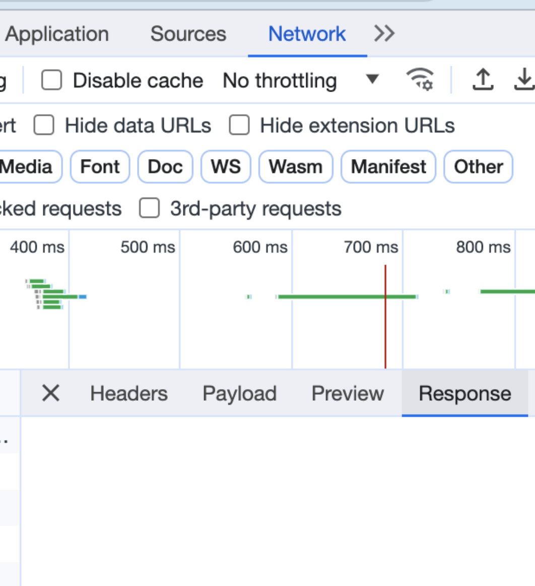

### Update:
_Fixed, but still curious why the problem happened..._

I found that the problem (described below) was resolved when I didn't specify a port, rather just used the default 8000 from Uvicorn. Here are the changes to the docker setup.

Dockerfile

...
EXPOSE 8000
...
docker-compose.yml

    ...
    command: uvicorn main:app --host 0.0.0.0 --reload
    ...
    ports:
      - 8000:8000
I'm still curious if anyone can explain why specifying the port causes the response to the patch response (and no others) to get stuck?

You can still reproduce it using the code from this repo if you want to check it out. Feel free to respond here or on [stack overflow](https://stackoverflow.com/questions/77206343/response-from-patch-request-in-a-docker-container-never-making-it-to-the-clien).

# Problem with response from `PATCH` request + docker

I noticed recently that responses from any `PATCH` requests sent to my `FastAPI` / `Uvicorn` backend in a docker container no longer make it to the client.

## Steps to reproduce

- In this directory, run:

  - `$ docker compose build`
  - `$ docker compose up`

- Send requests to `http://0.0.0.0:8000/` for all methods in `main.py`
- All will show 200 resopnse in terminal (including `PATCH`)...

```
test-patch-docker ... "GET / HTTP/1.1" 200 OK
test-patch-docker ... "POST / HTTP/1.1" 200 OK
test-patch-docker ... "PUT / HTTP/1.1" 200 OK
test-patch-docker ... "PUT / HTTP/1.1" 200 OK
test-patch-docker ... "PATCH / HTTP/1.1" 200 OK
test-patch-docker ... "DELETE / HTTP/1.1" 200 OK
test-patch-docker ... "HEAD / HTTP/1.1" 200 OK
test-patch-docker ... "OPTIONS / HTTP/1.1" 200 OK
```

- However, the response from the `PATCH` request never makes it to the client while all others do.
- This means, in the browser, it becomes an promise that never resolves (tried using axios and fetch apis, each with `async/await` and `.then`). The network response, just stays empty:



- In postman, it gets stuck on the loading screen


Reproduced in multiple browsers and Postman

I have a 2020 MacBook Pro and noticed this problem before and after upgrading MacOS (timing by chance). Also in an effort to address it, I upgraded Docker, Uvicorn and FastAPI and tried a different python image. I don't remember the specific versions I had of Docker Engine and Compose previously, but here's the software I've reproduced this on otherwise:

| Software       | Versions                                                |
| -------------- | ------------------------------------------------------- |
| MacOS          | Ventura 13.0 & OS Sonoma 14.0                           |
| Docker Desktop | 3.26.0 & 4.24.0                                         |
| Docker Engine  | (earlier-version) & 24.0.6                              |
| Docker Compose | (earlier-version) & v2.22.0-desktop.2                   |
| Python Image   | python:3.11.1-slim-buster & python:3.11.5-slim-bullseye |
| Uvicorn        | 0.17.6 & 0.23.2                                         |
| FastAPI        | 0.82.0 & 0.103.2                                        |

I've also tried it with and without CORS middleware (as permissive as possible)

## Contrast with

If I install the same Uvicorn and FastAPI versions outside of docker and run:

- `$ uvicorn main:app --reload`

...All methods' responses show up as expected when tested, including `PATCH`

## Any suggestions???
